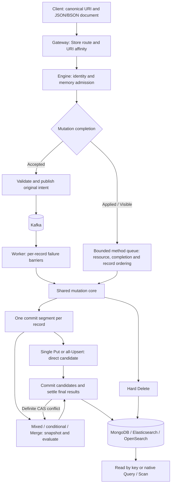

# Document lifecycle and execution ownership

This review follows the current record lifecycle through the SDK, Gateway,
Engine, Worker and adapters. The architecture keeps one execution core for
synchronous and queued mutations. A document does not move through a persisted
Sink workflow or task state machine: storage owns the document, and Kafka can
own a pending mutation intent.

## Lifecycle



| Stage | Owning code | Responsibility |
| --- | --- | --- |
| Address, encoding and original result indexes | SDK and `internal/protocol` | Keep canonical identity and explicit document encoding across boundaries |
| Routing and fanout | `internal/gateway` | Select an Engine for each full URI and aggregate partial results |
| Admission and synchronous scheduling | `internal/service/batcher.go` | Bound waiting work, acquire Store capacity, select one resource/completion partition and track queued/active record dependencies |
| Mutation semantics | `internal/service/write.go`, `write_group.go` | Evaluate Create/Replace/Upsert/Merge, maintain the snapshot condition and commit document segments |
| Response ownership | `write_completion.go`, `write_return.go`, `response_groups.go` | Keep each caller's indexes and output limits; release a record only after its remaining operations finish |
| Durable acceptance | `internal/service/publish.go`, `internal/queue/kafka/publisher.go` | Publish every original intent and acknowledge Kafka acceptance |
| Durable application | `internal/worker/processor.go`, `internal/queue/kafka/worker.go` | Apply through the core, block successors after temporary failure, settle DLQ and contiguous offsets |
| Backend translation | `internal/storage/mongodb`, `internal/storage/search` | Implement native identity, encoding, bulk operations, revision checks and visibility |

Read deduplicates addresses inside a batch and returns independently owned
results. Delete deduplicates synchronous operations and permanently removes the
record; async Delete publishes every intent. Native Execute/Query/Count/Scan
share Store admission and connections, but use backend semantics and bypass
record folding and Kafka.

## Simplifications implemented

### One synchronous scheduler

Previously, `requestBatcher.selectReady` partitioned mutations by resource and
completion mode, then `executeWrites`/`executeDeletes` constructed another
per-record wave plan and optional goroutines. That second planner only received
homogeneous partitions in normal dispatch. It repeated URI parsing, dependency
maps and cancellation setup without adding an ordering guarantee.

The dispatcher now owns scheduling once. The batch executor combines the
selected calls, invokes the core and delivers results. Completion-mode,
transitive-dependency and cancellation tests exercise the dispatcher rather
than depending on mixed-mode calls to a private executor.

Worker waves remain: a temporary error must stop following queued mutations for
the same record, while a permanent failure may allow a later correction. That
failure barrier is different from the synchronous dispatcher's admission and
ordering responsibilities.

### One write commit path

Direct Puts and snapshot-based chains now build the same candidate structure
and call `commitWriteCandidates`. Returned-document reservation, backend result
count validation, result application, document attachment and caller completion
have one implementation. Only snapshot-based conflicts enter the bounded retry
loop; a direct Create/Replace condition failure remains final. Unknown write
outcomes are never replayed by this loop.

Snapshot preparation chooses the commit precondition once, from the original
observation. Put and Merge only advance the working document and existence
state. A Lua or condition failure leaves that working state unchanged. A CAS
retry reevaluates the entire segment against the new snapshot, including any
previous speculative failures.

### Commit boundaries instead of repeated tail scans

A `return_document` operation remains an independent commit. Runs without this
option fold on either side:

```text
Upsert A, Upsert B, returned Merge C, Upsert D, Merge E
         [A, B]            [C]             [D, E]
```

Previously, a returned operation anywhere in the remaining chain caused every
preceding operation to execute separately. The loop also repeatedly scanned
that remaining chain. `writeGroup.nextCommit` now consumes each segment in
linear total planning work. It retains the existing final-state folding
contract: intermediate ordinary writes are not individually persisted or
validated by the backend. Callers requiring each intermediate commit must
request a returned document for each operation or wait between calls.

## Evidence and boundaries

`BenchmarkReturnedWriteSegments` submits 64 Upserts to one record with operation
33 requesting a document. Measurements on Apple M2 / Go 1.27, three runs of
20 iterations, compare baseline `6246d45` with this change:

| Measurement | Before | After |
| --- | ---: | ---: |
| Backend writes per batch | 34 | 3 |
| Median batch time with 1 ms simulated storage delay | 39.78 ms | 3.54 ms |
| Allocations per batch | 1,226 | 947 |
| Allocated bytes per batch, no simulated delay | 76,579 | about 64,877 |

These are core microbenchmarks, not public RPC or production latency estimates.
Streaming RPCs retain their configured microbatch boundaries, so folding never
crosses a stream chunk merely to reproduce this benchmark.

Regression coverage includes returned operations at the first, middle and last
positions, adjacent and separated boundaries, direct and Lua segments, all 486
five-Put condition sequences, CAS recomputation, unknown acknowledgements,
returned-output limits, per-caller completion and asynchronous failure barriers.

Validation completed with `make build lint`, the production suite's
`SINK_SERVER_DIR=/path/to/sink make test-candidate` (race instrumentation,
1,883 passing tests/subtests, no skips, all coverage floors met), and
`make test-server-integration` against disposable MongoDB, Elasticsearch and
OpenSearch instances. Additional returned-segment positions and dispatcher
regressions passed five repeated race runs. These checks qualify the local
change; they are not a production deployment or load test.

The existing reliability boundaries remain essential: ordering is local to a
method queue or Kafka key, replicas and Native mutations can race, and async
delivery is at least once. CAS protects the observed document version; it does
not deduplicate business intent. Backend-specific validation and revision
handling remain in adapters, and Lua sandbox limits remain in the Lua runtime.
These responsibilities should not be folded into a generic workflow engine.
