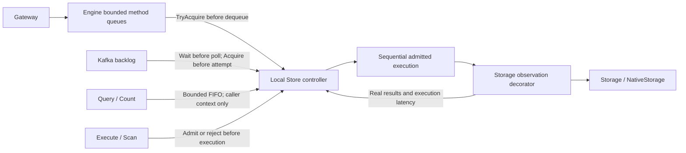

# Adaptive Store backpressure

Gateway/Engine/Worker scaling adds application processing capacity. Store
backpressure independently regulates the work those processes send to the
database. Queue demand can request growth, but only healthy backend completions
raise the Store window; queue growth or Kafka lag alone cannot do so.
The controller does not consume replica counts, HPA signals, CPU, memory,
connection counts, Ping results, or discovery information.

Each Engine and Worker owns one `internal/backpressure.Controller` for its
configured Store. Replicas converge through real backend feedback, without a
leader, distributed semaphore, external state, or coordination service. This is
adaptive aggregate load control, **not a strict global concurrency invariant**.
Transient overshoot and unequal shares are possible; no finite startup jitter can
guarantee zero overshoot for an arbitrarily large simultaneous deployment.

## Admission boundary

Engine's three existing batch dispatch loops select dependency-ready work, then try admission **before**
releasing queue bytes/operations, recording active records, or launching execution.
When blocked, they continue handling arrivals, cancellation, record completions and
shutdown while waiting for a capacity notification or a cooldown timer. Pending
work remains charged to the original queue, even when represented in the
dispatcher's pending slice. Queue-full behavior remains `RESOURCE_EXHAUSTED`.
Finished executions retain their permits until the dispatcher receives completion,
so goroutines waiting to report completion cannot escape the concurrency bound.

One permit covers one sequential execution, including parsing, Lua, snapshots,
CAS attempts, and result settlement. Existing batch partitioning produces one
completion mode per dispatch. Mixed internal waves also stay sequential when
admission is present. The Storage decorator **does not acquire or block**. This
avoids moving a bounded queue into unbounded semaphore waiters, and avoids
deadlocking a Merge which already owns its execution slot.

Read, Write, Delete, Execute, Query, Count and Scan share the same controller.
Query and Count share a bounded admission FIFO. A full execution window or an
overload cooldown leaves those requests waiting rather than rejecting a healthy
burst. `batching.queue.max_operations` bounds waiting requests (one command per
request), and `batching.queue.max_bytes` bounds retained encoded request bytes.
These are the same configured limits as the batch queues, not a second queue on
top of an existing Read/Write/Delete queue. Only the head competes for a Store
permit; no goroutine is spawned by admission. Query/Count are FIFO with respect
to each other, not globally ordered with the independent batch dispatch loops.

There is **no new server-side admission timeout**. A caller with no deadline can
wait until capacity is available or its context is canceled. A caller deadline
is propagated unchanged, and cancellation removes queue charges without entering
the backend. Only a full waiting queue rejects with `RESOURCE_EXHAUSTED`.
Encoded bytes are a bounded accounting unit, not an exact Go heap estimate;
process memory admission and gRPC message limits remain independent safeguards.
Admission waiting never shortens the lifetime of an already executing permit.

Execute and Scan keep their fail-fast admission semantics. Engine marks a Store
admission or read-queue rejection `sink-forward-not-started`; a backend error with the same gRPC code
does not receive that evidence. Async publication bypasses Store admission;
Kafka producer bounds still apply, and Worker controls the later application.

Worker waits **before polling**, outside `consumer.processing_timeout`, with
fetching paused and group heartbeats/rebalances intact. It acquires a permit
before each handler attempt and releases it before Kafka retry backoff and
settlement. A retained poll remains bounded by `consumer.max_poll_records`.
Admission waiting spends no retry attempt and is cancellable by processing
timeout, rebalance, or shutdown. Unresolved records remain uncommitted; it cannot
turn a temporary failure into a DLQ entry. Worker currently processes polls and
mutation waves sequentially; this feature does not add parallel poll processing.

## Window algorithm

The window algorithm has fixed-size feedback state and one short mutex-protected
update per Store observation, alongside the bounded Query/Count FIFO. Engine
actively completes randomized initialization in `Run` **before serving readiness
or RPCs**, without issuing a synthetic database request. Worker retains its
first-poll initialization. Subsequent saturation or cooldown does not flap readiness.

| Event | Behavior |
| --- | --- |
| Initialization | Stagger for a random 0.5–1.5 seconds, then open `min(4, maximum)` executions before Engine readiness |
| Healthy demand | Saturation or queued Query/Count requests request growth; require at least `max(4, window)` healthy samples and a jittered 125–375 ms control interval |
| Initial growth | Add `max(1, window/2)` below a slow-start threshold of 16 |
| After congestion | Threshold becomes half the previous window; subsequent growth is additive by one |
| Sustained latency inflation | Halve the window, retaining at least one execution so successful work continues and the baseline can adapt |
| Retryable overload/unavailability/timeout | Immediately set the window to zero, then resume real traffic at half the previous window, at least one |
| Repeated failed recovery | Double nominal cooldown from 200 ms up to 10 s; actual delay is uniformly 0.5–1.5 times that value |
| Recovery | Four clean observations reset cooldown escalation, including under light traffic |

All jitter comes from an independently seeded process-local random source. No
synthetic request is sent when cooldown expires: a real waiting execution is the
recovery probe. Old responses from before a decrease cannot apply that decrease
repeatedly or undo it with stale successes. Growth does not suppress a late
overload from an earlier, slower call.

The adaptive window ceiling accepts **1–4096**. Store `max_concurrent` is
optional; when omitted, the default is **64** for MongoDB and **128** for
Elasticsearch or OpenSearch. The ceiling is local to each Engine/Worker process,
not a database capacity estimate or a per-replica allocation of a global quota.
The feature is always wired by application assembly. Internal component tests
can omit the controller to exercise other boundaries independently.

## Feedback and latency

Observation occurs immediately around the existing Storage method invocation,
after dispatch admission and service preparation. It does not include Engine
queue wait, Worker admission wait, Lua execution, or response sending outside
the Store call. Driver work, encoding inside adapters, driver retries and backend
refresh waits remain part of that method's execution time.

One batch contributes one observation. Any explicitly classified retryable
`ResourceExhausted`, `Unavailable` or `DeadlineExceeded` result makes the call a
congestion observation, including a partial batch. `context.DeadlineExceeded`
and corresponding gRPC errors are recognized. Caller cancellation, semantic
errors, unknown errors, malformed result counts and local nonretryable size
limits do not cause decreases or healthy growth. Original results are returned
unchanged. Conflict and precondition failures do not count as overload even if
their existing retry flag is true.

Latency learning is separate for Read, Write, visible Write, Delete, visible
Delete, Execute, Query, Count and Scan, with four bounded operation-count classes:
1, 2–32, 33–128, and 129+. The short EWMA uses weight 0.25. The baseline uses
weight 0.01 in both directions, tracking the long-term mean without bias toward
fast replies in a variable workload. After four samples, two successive short-EWMA observations
above both 1.5 times baseline and baseline + 5 ms trigger a decrease. The
window itself is shared, so a congested method reduces subsequent admission for
every method. No URI, dataset, query text, document identity or error string is
used as a state key or metric label.

Opaque Execute commands can have arbitrarily different costs. They contribute
success/error feedback and measured duration, but do not train latency control.
The optional internal `NativeResponse.Failure` normalizes native overload replies
which otherwise arrive with a nil Go error: HTTP failures, native bulk item
overloads, MongoDB command timeouts/unavailability, and native write concern/item
failures. It is observation metadata only. Native payloads, status codes,
`Success`, and mutation retry rules remain unchanged. Driver-specific code only
normalizes errors; all control decisions use the common storage contract.

The decorator exposes NativeStorage if and only if the wrapped Store supports
it. Application ownership and health checks retain the original Store, preserving
search connection cleanup and MongoDB lifecycle behavior.

## Streaming, cancellation and reliability

Query/Scan wrap the synchronous `Emit` callback and subtract its elapsed time.
Callback failures, deadlines reached inside the callback, and driver timeouts
dominated by callback waiting are ignored as congestion. There is no buffering
goroutine or additional page queue. The execution permit stays held while a
cursor/response body can resume backend work, bounding slow-client resources.
This deliberately favors bounded resource use over counting only active network
waits as occupied slots.

A decrease never cancels a permit, revokes an active record dependency, or
interrupts an accepted mutation. Already admitted sequential work can finish its
existing multi-step algorithm even while the window is zero. Only later
executions wait. Caller cancellation and normal shutdown still propagate through
the existing contexts. A canceled caller does not release its active permit until
the backend actually returns. No timeout, unknown write result, partial result,
or ambiguous native response is newly replayed by the controller.

Health checks continue calling the original backend. They neither consume
permits nor produce feedback. Waiting before a Worker poll does not set its
recovery error or make it unhealthy. Genuine backend/Kafka failures retain their
existing health behavior.

## Scope and operational limits

The controlled unit is an admitted sequence of **Storage interface calls**, not
individual database commands, sockets, records, shards, or transactions. Existing
adapter bulk/group fanout is preserved; one Storage call can issue several
backend commands. Batch targets, request byte bounds and poll bounds therefore
remain important. Changing the request mix within a latency class can also cause
a conservative decrease until its baseline adapts.

There is no capacity estimate without real observations. A backend stuck forever
without returning cannot provide feedback; caller/driver deadlines and graceful
shutdown retain their existing role. Local feedback cannot promise an exact
global maximum, equal per-instance throughput, or protection against non-Sink
database clients. Those limits are inherent in the requested coordination-free
model. The ceiling and cold-start window do not depend on deployment size.

HPA/KEDA should scale application CPU, memory, queueing and consumer capacity.
Monitor Store window reductions and backend latency separately: adding replicas
to a database-bound workload cannot create database capacity. Do not derive
Store concurrency from desired/current replicas or automatically raise its
ceiling when queues grow. Connection-pool sizing remains a separate deployment
concern because adaptive admission does not close idle database connections.

## Verification

Component tests cover healthy growth, latency-only decreases, overload pauses,
cooldown recovery, per-method baselines, batch-size classes, stale replies, mixed
batch results, native errors/capability, callback timing, deadline/cancellation,
permit release, queue saturation, shutdown, same-record ordering, conflict
retries, and known-versus-unknown native admission outcomes. An actual batcher
test grows dispatch concurrency from delayed Store replies without injecting
controller samples.

A seeded discrete-event simulation runs 1, 8 and 100 independent controllers
against a shared backend with capacity 8 → 2 → 8, checking recovery, bounded
overload traffic, startup staggering and progress across instances. It is a
repeatable algorithm regression, not a production throughput benchmark.
The initial window of four retains this startup-overshoot gate: an eight-slot
initial window failed the 100-instance regression. Healthy burst tests also
require progress without rejection, rather than treating a tiny initial window
as sufficient protection. Deterministic virtual-time tests hold a caller for an
hour without a server-added deadline, cancel the head/middle/tail of the FIFO,
exercise byte/count bounds and cooldown, and verify exact permit/queue cleanup.
Race tests concurrently release permits, cancel callers and collect metrics.
Kafka component tests use an in-process broker to verify that paused intake
does not spend processing timeout, report unhealthy, advance offsets, or produce
dead letters; another test verifies a real processor's overload/cooldown retry.

See [Store metrics](../observability.md#store-backpressure) and
[configuration](../configuration.md). Real-process Elasticsearch/OpenSearch congestion and Kafka backlog regressions
are required by [sink-production-suite](https://github.com/batchstream/sink-production-suite/pull/35).
Its one/four-Engine tests inject delay and 429s in front of disposable real backends;
they are fault/recovery qualification, not a production capacity benchmark.
