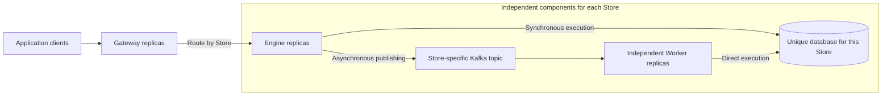

# Sink Store-Isolated Architecture Design

Historical design record. The current address and deployment contract is defined in [Record URIs and Engine affinity](../record-addresses.md).

Status: **Implemented and locally validated; not released or deployed to production**

Version: D4, 2026-09-16

Baseline used to verify existing behavior: `005a056`

Scope: Sink, sink-go compatibility, and sink-production-suite validation. This document does not assign a release version.

This document records the design agreements established before development, so that implementation does not reintroduce multi-Store processes, platform coupling, or incorrect retry semantics.
**The user explicitly authorized further documentation, development, and testing based on engineering judgment. The implementation decisions below follow that authorization; they do not imply individual user review. Release and production deployment remain separate decisions.**
This document records both design agreements and implementation decisions. The [runtime guide](../store-isolation.md) describes the implemented fields, migration steps, and limitations.

## 1. Confirmed Design Agreements

The following agreements were explicitly confirmed by the user. Later proposals must not override them; any change requires an updated design and user confirmation.

| ID | Confirmed agreement |
| --- | --- |
| C01 | Establish the design agreements first. The user subsequently authorized development, testing, and complete removal of the old architecture. Preserve the public client protocol and other confirmed boundaries. |
| C02 | Use three components: Gateway, a single-Store execution service, and a single-Store asynchronous Worker. Deploy and scale them independently. |
| C03 | Each Store owns a unique backend database. Multiple Stores sharing the same backend database target are unsupported. |
| C04 | Each execution-service process handles exactly one Store. All replicas of that service belong to the same Store. |
| C05 | Each Worker process handles asynchronous messages for exactly one Store. It accesses the database directly and shares execution-core code with the execution service. |
| C06 | Asynchronous publishing stays in the single-Store execution service. Gateway retains its routing responsibility. |
| C07 | Preserve the existing public client protocol and cross-Store batch APIs. Only Gateway splits requests and merges results. |
| C08 | Gateway must be efficient and stateless. The architecture must not depend on Kubernetes or any particular deployment platform. |
| C09 | The current deployment uses KEDA to query metrics and scale workloads. Components expose metrics without implementing platform-specific scaling logic. |
| C10 | Low-traffic Stores use fewer resources and replicas. Production execution services retain at least one container; Workers may cold-start. These are deployment policies, not business-code rules. |
| C11 | Execution services and Workers bind to and validate their own Store. The public protocol continues to carry Store identity to prevent incorrect routing. |

The single-Store execution service is named **Engine**. All three roles use separate runtime modes of the same binary.

## 2. Goals and Boundaries

Growth in a hot Store should increase only its own execution resources and database connections, without forcing low-traffic Stores to scale alongside it.
Adding Stores must no longer require one execution process to keep increasing its CPU, memory, connection pools, and dependency health checks.

Each Store's Engine and Worker can scale independently, but both remain subject to that Store's database connection and throughput budgets.
Separating processes does not eliminate physical database limits, hot Kafka partitions, or contention on the same record.

The first version does not introduce cross-Store transactions, global write ordering, exactly-once delivery, a persistent Gateway task log, automatic database migration, or server-driven platform wake-up.
Batching, Lua, and storage adapters remain in-process rather than becoming separate remote services.

## 3. Components and Data Paths



| Component | Responsibilities | Excluded responsibilities | Connections and configuration |
| --- | --- | --- | --- |
| Gateway | Routing, public request boundary validation, cross-Store splitting and result merging, request-level budgets, forwarding backpressure, observability | Lua execution, database access, Kafka publishing or consumption, business-operation retries | Engine service addresses, downstream connections, secure transport settings; no database or Kafka credentials |
| Engine | Read/Write/Delete/Execute/Query/Count/Scan for one Store, batching, Lua, conditional writes, asynchronous publishing | Multi-Store routing, Kafka consumption, cross-Store result merging | This Store's database connection pool; a producer when asynchronous publishing is enabled |
| Worker | Consumption, execution, retries, DLQ handling, and offset commits for one Store | Public business RPCs, cross-Store routing, calling Engine RPCs to perform writes | This Store's database connection pool, consumer, and DLQ producer |

Reuse the execution core from the same repository and version, with three explicit process-assembly paths.
Engine and Worker directly call the same storage, Lua, conditional-write, and budget code. Worker must not start a gRPC server merely to reuse that logic.
Gateway does not initialize the execution core, Lua VMs, database driver instances, or Kafka producers.
The same binary provides `gateway`, `engine`, and `worker` modes; packaging does not change the role boundaries.

### 3.1 Store and Database Identity

Store is the stable public routing identity. A database target is a stable backend asset identity in the deployment inventory, not a particular connection URI string.
DNS aliases, node addresses, or different credentials for the same database must not be used to register multiple Stores.
A database target may contain multiple replica nodes. Existing namespace/dataset semantics remain unchanged and are not reinterpreted as Stores during this redesign.

Use the globally unique Store name as the sole configured identity. Engine and Worker
bind it through Store file `name`; Gateway routes and public requests carry the same
value as `store`. Replicas of one Store share that name, while different Stores
must have different names. No additional database identifier is required.

- Gateway routes declare Store names without storing database connection details.
- Engine/Worker startup configuration binds one Store. Engine returns its Store name in every internal response.
- Gateway checks the response Store, and Engine validates the forwarded Store and every operation's Store before execution.
- Engine rejects an entire request containing the wrong Store before any write or publication occurs.
- Worker does not execute messages for the wrong Store. It treats them as explicit permanent errors and does not commit the corresponding offset until DLQ delivery is acknowledged.

Gateway rejects duplicate Store names in a route snapshot. The deployment inventory
owns uniqueness across configurations and the one-Store-to-one-database mapping.
Name checks cannot detect an incorrect URI under a matching Store name, or prove
that two different connection URIs refer to different databases. No global runtime
registry or historical Store/database association cache is introduced.

## 4. Route Configuration, Updates, and Migration

### 4.1 Platform-Neutral Route Input

Gateway reads `gateway.routes` from its own configuration at startup. Each route
contains a Store name, Engine target, and transport settings. Every configured
route is active; there is no state flag, separate route file, or hot reload.
Concurrency, byte, and connection limits belong to the same process configuration.
Request handling never queries configuration services or deployment APIs.
See the [runtime guide](../store-isolation.md#configuration) for final YAML fields.

Restart Gateway after any configuration change. An invalid initial configuration
fails startup. Each process keeps an immutable route snapshot, so all subrequests
of a public RPC use the same configuration. During a rolling restart, deployment
tooling confirms that all intended instances report the expected route hash.
DNS discovery still selects changing Engine replicas within the configured target.

### 4.2 Connection Lifecycle

Create downstream connections on demand and reuse them. Bound the cache globally
and per target; reclaim idle entries while protecting active calls. On process
shutdown, drain accepted calls within the deadline before closing connections.
A closed connection does not prove that a mutation had no side effects.

New replicas of a Store must receive new RPCs. Validation covers DNS replica
arrival, departure, and load distribution with long-lived connections.

### 4.3 Route Changes

Add, change, or remove entries in `gateway.routes` and restart Gateway. Removing a
route stops new instances from forwarding to that Store; it does not delete the
Store's database, topics, or workloads. Old instances retain their startup routes
until they stop, so emergency access revocation belongs at Engine/network controls.
Change credentials or backend targets through coordinated Engine/Worker rolling
updates. Database changes require a drain and data migration plan; the Store name
check alone cannot detect a different database configured under the same name.

### 4.4 Meaning of Stateless

Route snapshots, connection caches, metrics, and in-flight request budgets are reconstructible process state, not persistent business state.
Gateway replicas do not replicate request state or require sticky sessions. Scan cursors retain their existing semantics without database sessions.
A Gateway crash can leave callers without results for in-flight RPCs. A new replica cannot recover those RPCs or automatically replay their writes.

## 5. Public Protocol and Cross-Store Requests

### 5.1 Responsibility and Compatibility

Preserve the seven methods, public fields, and client usage of `sink.v1.Sink`. Single-Store requests use the same Gateway contract.
The routing layer does not rewrite business fields, document encoding, keys, revisions, Lua, or completion modes in the original protobuf request.

| API | Gateway behavior | Engine behavior |
| --- | --- | --- |
| Execute/Query/Count/Scan | Route by the Store in Command.uri; preserve business responses, cursors, and bounded gRPC error details | Execute only for the bound Store |
| Single-Store Read/Write/Delete | Use a fast path while preserving request and result boundaries | Execute within local batching and budgets |
| Cross-Store Read/Write/Delete | Group, schedule, and restore original operation_index values and result order | Each subrequest contains operations only for the bound Store |

Gateway completes request-level validation before sending anything downstream: empty requests, total operation count, invalid completion modes, invalid return-document combinations, Lua declaration digests, and similar checks.
Invalid operation addresses and unknown Stores retain per-operation failure semantics and do not block other valid operations.
Gateway neither compiles nor executes Lua. Engine validates programs and backend-specific constraints.

Grouping by Store preserves original order within each group. Gateway must not split a complete chain of operations on the same record into parallel calls.
Validate request-level Lua declarations in full before forwarding the declarations referenced by each subrequest. References must not be omitted, and an invalid global declaration must not fail on only one Store.
Validate result counts, local indexes, uniqueness, and legal states before mapping results back to the original request.
Cross-Store requests remain non-transactional. This design adds neither compensating rollback nor global ordering across replicas.

### 5.2 Internal Forwarding Contract

Copying the public RPC unchanged to multiple Engines is insufficient to preserve the original request's shared budgets.
Gateway and Engine use a versioned internal forwarding contract while the public client protobuf remains unchanged.
The internal contract adds only Store identity, request correlation, budget grants/settlements, and capability information. Business requests and responses reuse the public messages.
This is a new internal capability introduced by the design and requires implementation and validation.

Internal protocol v2 has a fixed set of seven methods and four document-budget categories. Each call validates version and identity without a separate capability-negotiation round trip. Request limits are validated in each process's configuration. Version 2 uses only the Store name for identity; the removed database field number and name remain reserved. Gateway and Engine must run matching protocol versions; a version mismatch fails before execution.
An incompatible target makes only its route unavailable. Internal methods must not become unprotected entry points that bypass public limits.
Gateway does not trust internal control fields supplied by clients. Engine uses the smaller of each internal grant and its local limit.
When Engine combines multiple original calls, it retains their separate budget ownership and never pools one request's allowance with another's.

### 5.3 Request Budgets: Check Before Commit

There are three distinct kinds of budget; they must not be collapsed into one configuration value:

1. **Public request contract:** total operations, input message size, read/returned-document limits, and deadline. Splitting a request must not turn a 32MiB allowance into 32MiB per Store.
2. **Gateway resources:** input, results, envelope overhead, in-flight subrequests, and connection caches. Both global and per-route usage are bounded.
3. **Local Engine/Worker resources:** working sets, driver buffers, Lua, queues, and connection pools, limited within each process.

**The first version uses two scheduling paths:**

| Request type | Scheduling |
| --- | --- |
| Delete, plain Put known not to consume shared document budgets, and asynchronous acceptance requests | Bounded parallelism by Store; reserve status/error envelope space for the entire public response |
| Cross-Store Read and synchronous Write containing Merge, conditional writes, or returned documents | Execute complete Store groups in order of first appearance, using the remaining budget; batching within each group remains available |
| Single-Store requests and the four native RPCs | No cross-Store scheduling; apply both public and Engine limits directly |

Whether a plain Put qualifies for the fast path must follow actual execution semantics. Operations that coalesce into a conditional chain must not be misclassified.
If any part of a mixed synchronous Write needs shared document budgets, the entire request uses the budget-aware path. Do not discover a total-budget violation only after parallel commits.

Rules for the budget-aware path:

1. Gateway creates one document-budget ledger for the request. Account for budget categories separately according to existing semantics; do not arbitrarily add inputs, snapshots, and responses together.
2. Before scheduling a Store, grant Engine the remaining snapshot, conditional-output, and returned-document allowances, subject to its local limits.
3. Engine enforces limits when retaining read results, generating candidate documents, and **before committing writes**. It returns known results and the corresponding budget settlement.
4. Retained responses continue to consume Gateway capacity. Releasable temporary working sets are released only after their owner has finished.
5. Process the next Store only after Engine returns a complete settlement. CAS retries do not reset the public request's returned-document allowance.
6. A missing settlement is not evidence that a grant was unused. Conservatively retain the allowance delegated to that group. Continue other groups only with a balance that is provably available; do not wait indefinitely.
7. Operations with insufficient allowance receive the appropriate failure. Do not relabel known successful writes as unexecuted or silently discard returned documents promised by successful operations.

For snapshot/conditional-document budgets that currently reset on each attempt, internal settlement reports the group's maximum charge across attempts for each category. Gateway accumulates those values across Stores.
This mapping is safe but conservative: combining different retry attempts from different Stores can exhaust a near-limit request earlier than the old single-process implementation.
That boundary difference must be explicitly accepted during review and validated against the old implementation. Scheduling and the exact set of near-limit requests that succeed are not claimed to be identical.

**The cost is lower parallelism for budget-sensitive cross-Store requests.** The high-frequency single-Store path is unaffected by this serialization policy.
This avoids denying a large Store an otherwise available budget through equal allocation, and avoids distributed budget leases and wait cycles introduced solely for parallelism.
If review requires preserving parallelism on these cross-Store paths or every near-limit budget outcome, extend the coordination protocol before implementation. Never silently give every subrequest a separate full allowance.

Do not let every Store execute with a full allowance and then truncate returned documents at Gateway. Existing returned-document limits are checked before commit; truncation after commit would break that safety boundary.

### 5.4 Total Response and Memory Boundaries

Before scheduling, Gateway reserves space for result envelopes and the maximum permitted document occupancy. Final gRPC serialization must not be the first place that detects an oversized response.
Per-route and global forwarding budgets jointly bound active calls and retained responses, preventing a few slow Stores from consuming all Gateway capacity.
Capacity planning must also include input copies, downstream receive buffers, and protobuf encoding overhead. Public document allowances are not RSS limits.
If an Engine has a smaller request limit, Gateway must handle that mismatch before sending, based on declared capabilities. Configuration differences must not reject the rest of a request after an earlier part has already written.

## 6. Partial Failures, Timeouts, and Unknown Outcomes

| Condition | Response rule | Can writes be replayed automatically? |
| --- | --- | --- |
| Globally invalid request or Gateway rejection before any send | Top-level InvalidArgument, ResourceExhausted, or equivalent | Gateway does not replay; callers follow the existing error contract |
| An operation references an unknown Store | INVALID_ARGUMENT for that operation; other valid operations continue | No |
| A Store route is absent, identity mismatches, or scheduling fails before sending | Fail the affected operations; identify a safe temporary rejection only when non-dispatch can be proven | Gateway still does not replay |
| Engine returns complete, valid results | Preserve status, revision, document, and failure; restore original indexes | No |
| A subrequest disconnects, times out, or returns malformed results after sending | Operations in that group without confirmed results have unknown outcomes; preserve known results from other groups | No |
| The original call is cancelled/times out, or Gateway crashes | Cancel downstream promptly; the complete aggregate response may be undeliverable, and existing side effects remain | No |

Public Failure currently has only code/message/retryable, without a separate field indicating whether side effects occurred.
The first version leaves public messages unchanged. Unknown mutation outcomes use appropriate UNAVAILABLE/DEADLINE_EXCEEDED/INTERNAL failures, `retryable=false`, and an explicit explanation that the outcome is unknown.
This does not mean the error is permanently unrecoverable. It means safe automatic replay cannot be justified; applications must verify state or use their own idempotency mechanism.
Error text must not become a machine-readable protocol. If callers later need to distinguish unknown outcomes programmatically, review a backward-compatible field extension separately.
Reads have no write side effects and may retain existing client read retries. The first Gateway version adds no application retry layer.
Preserve explicit temporary Scan admission rejections and their retry details. Keep complete native Execute error responses distinct from transport errors.

Internal forwarding results can distinguish `not_started`, complete per-operation results, and unknown outcomes. Only verifiable `not_started` evidence permits mapping the entire group to unexecuted operations.
A gRPC status code alone, particularly downstream ResourceExhausted, is not such evidence.
If complete results are received, their successes must not be overwritten because another Store failed.
If the entire public RPC has already been cancelled or its transport has failed, delivery of known successes cannot be guaranteed. Delivered stream results remain known; undelivered mutation outcomes remain unknown.

Propagate the original context's remaining deadline and cancellation. Do not restart a full timeout at each hop.
When the client supplies no deadline, Gateway applies the public request timeout. Downstream processes may impose shorter local limits but must not extend the original deadline.
Completion boundaries for public responses, downstream execution, asynchronous durable acknowledgements, and Worker offsets remain unchanged.

## 7. Dependency Failures and Readiness

Separate a process's ability to accept work from the availability of each dependency. External failures must not cause pointless liveness restart loops.

| Component/failure | Behavior |
| --- | --- |
| Gateway has valid configuration; one Engine/Store fails | Gateway remains ready, the route reports failure, and other Stores continue normally |
| All Gateway backends are temporarily unavailable | The process may remain ready and return clear route-level errors; alert separately on aggregate availability |
| Engine database fails; Kafka is healthy | Synchronous execution is unavailable; valid asynchronous writes can still be durably published and return ACCEPTED |
| Engine Kafka fails; database is healthy | Synchronous execution continues; asynchronous requests fail without falling back to synchronous writes |
| Both Engine dependencies are temporarily unavailable | The process remains probeable, returns dependency errors, and continues recovery; removing it from traffic is a deployment policy |
| Engine has no Kafka configuration | Synchronous requests work; asynchronous requests fail as unconfigured without implicitly creating an asynchronous path |
| Worker database fails | Bounded pausing/retries, valid consumer-group behavior, and no commits for unfinished messages |
| Worker Kafka/DLQ fails | Retain unsettled progress and resume after recovery; do not commit corresponding offsets before DLQ acknowledgement |

Expose separate states for process liveness, readiness to accept work, and capability health. Engine reports at least synchronous storage and asynchronous publishing health separately.
Readiness depends only on valid configuration, required local assembly, listening, and not draining. It must not aggregate all dependencies into an all-healthy requirement.
Dependency probes support fast failure and recovery. Stale health snapshots must not indefinitely reject a recovered capability; probe retries must be bounded.
Kafka topic safety configuration and durable acknowledgement requirements still apply. Database unavailability is not a reason to skip message validation.
The process may enter its serving loop while external dependencies are unavailable. Deterministic configuration errors, such as malformed values or invalid identities, must still prevent startup.

### 7.1 Draining and Cold Starts

- Gateway stops accepting new requests, completes existing forwarding within a deadline, then closes connections.
- Engine stops accepting new work and allows running storage calls and Kafka acknowledgements to finish within a deadline. After that, it cancels work without claiming rollback.
- Worker stops acquiring new work, settles the completed contiguous offset prefix, and respects rebalance and shutdown deadlines. Existing at-least-once semantics recover unacknowledged work.
- A Worker starting from zero must load configuration, connect dependencies, join its consumer group, and resume processing without Engine RPCs.
- Cold-start triggers, minimum replicas, PDBs, resource requests, and container lifecycle hooks belong to deployment configuration, not the execution core.

## 8. Resource Model, Metrics, and the KEDA Boundary

A single-Store Engine no longer needs a global Store routing table or multi-Store subquotas such as `max_requests_per_store`. Its process-wide limit is the limit for that Store replica.
Separate synchronous execution, asynchronous publishing, Scan sub-budgets, and bounded queues remain useful. Architectural isolation does not justify removing all overload protection.
Gateway combines per-route and global limits with bounded waiting queues. HPA/KEDA response time is not a substitute for backpressure.
All allowances are per instance; adding replicas increases total concurrency. The first version does not provide strongly consistent rate limiting across replicas.

Plan database connection budgets as follows. A budget is not the number of connections that are always open:

```text
Store database connection budget
  >= maximum Engine replicas × database connection budget per replica
   + maximum Worker replicas × database connection budget per replica
   + headroom for driver monitoring connections, rolling-update peaks,
     and other authorized users
```

Engine and Worker scaling may trigger independently, but their maximum replicas and pool limits must jointly fit database capacity.
A cross-instance coordinator is not required to borrow connection allowance dynamically. Gateway scaling must not increase database connections.

| Component | Required observability | Interpretation for deployment scaling |
| --- | --- | --- |
| Gateway | Own CPU/memory, in-flight forwarding, buffered bytes, route waits/rejections, downstream latency, connection count, startup route version | Distinguish forwarding pressure from downstream failures; do not scale solely on total response latency |
| Engine | CPU/memory, execution and publishing pool occupancy, queue waits, rejection reasons, storage latency, Lua duration, connection use/waits, publishing latency | Determine whether replicas can reduce local waits; do not scale indefinitely when the database is saturated |
| Worker | Kafka lag, oldest unprocessed-message age, processing rate, CPU, batch duration, retries/DLQ, last consume/commit time | Distinguish insufficient processing capacity, hot partitions, and dependency failures; partition parallelism limits scaling |

Expose `/livez` and `/readyz` through the always-on `health.address` listener
(default `:8081`). Prometheus uses a separate `prometheus.address` listener
(default `:9090`), started only when `prometheus.enabled` is true; the default is false. Define names together with the existing-metric migration mapping before implementation.
Labels use only configured Stores and bounded method/result/reason values. Never use keys, datasets, arbitrary unknown Stores, or request IDs as labels.
Define connection metrics according to what the driver can actually observe. Do not invent precise values for unavailable statistics.
Gateway diagnostics may include Store identity but must not expose backend credentials.

The current deployment uses KEDA to query these metrics or Kafka lag. KEDA and its scaling targets belong to deployment; components do not call them.
Multiple scaling metrics do not inherently form a logical AND. Backend saturation protection needs deployment metric expressions, maximum-replica constraints, and validation.
Worker parallelism is bounded by consumer-group partition assignment. Increasing Kafka partitions may change routing for the same key and must not be an automatic scaling side effect.
A production Engine minimum of one instance, Worker scale-to-zero, low-traffic resource sizes, and scale-down stabilization windows remain deployment policies.

## 9. Migration from the Current Version

1. Use the authorized implementation decisions in Section 11 as the migration baseline. This document does not assign a release version or authorize production deployment.
2. Introduce single-Store Engine/Worker configuration and the shared execution core, preserving the public client protocol and storage formats.
3. Route the new Gateway to Engines that support the internal contract. Do not use the old multi-Store Server as a permanent compatible backend.
4. Complete offline protocol tests and isolated-environment validation before preparing production routes and per-Store configuration. Never put real credentials in documentation.
5. Complete component health and capability checks first. Read-only comparison is allowed; do not duplicate real mutation requests onto old and new paths for shadow validation.
6. Switch traffic by Store, verifying old-connection draining, traffic reaching new replicas, and business results. Do not promise global ordering across old and new paths during migration.
7. Worker migration preserves topics, consumer groups, key encoding, partition counts, and offset contracts. Choose rolling or drain-and-switch migration after assessing mixed-version compatibility.
8. Rollback retains accepted Kafka messages and database writes. Do not resend writes to recover call results or automatically fall back to a different database target.

The three supported modes use independent assembly paths. The removed `server`/`all` modes and plural `storages` configuration are rejected. Engines and Workers cannot assemble multiple Stores.
The Go SDK must be able to switch to Gateway without changing public usage. New diagnostic capabilities must not be prerequisites for basic reads and writes.

## 10. Validation Criteria

The following criteria define the required behavior. The [validation record](store-isolated-validation.md) identifies completed checks and the remaining production-validation boundaries.

| Scenario | Required evidence |
| --- | --- |
| Local process/container deployment without Kubernetes | All three roles work without platform APIs, KEDA, or controllers as runtime dependencies |
| Engine receives multiple Stores or the wrong Store | Reject before any storage or Kafka side effect |
| Worker receives a message for the wrong Store | No database write; DLQ/offset handling follows the confirmed policy |
| Seven APIs for one Store | Compatible with the existing protocol, documentation, client, and production suite |
| Mixed cross-Store batches | Correct result count, original indexes, duplicate-key ordering, Lua references, and completion mode |
| Globally invalid declarations | No Store starts writing or publishing |
| Partial downstream failure | Preserve complete known successes, never retry mutations, and never disguise unknown outcomes as unexecuted operations |
| Request cancellation or Gateway crash | Downstream resources are eventually released; completed side effects are acknowledged as possible, and callers receive no fabricated success |
| Returned documents/conditional writes near the total allowance | Enforce limits before commit without Gateway truncation of successful returned documents; explicitly record differences from the old implementation |
| Missing budget settlement | No allowance reuse or deadlock; remaining Stores follow ledger and failure rules |
| Route change and Gateway restart | Running instances retain startup routes; new instances validate changed routes; old connections drain during shutdown |
| Downstream identity/version mismatch | Reject only the affected route without incorrect writes |
| One Store's database slows down or disconnects | Effects on other Stores' queues and tail latency stay within agreed bounds; the same Store's asynchronous capability follows the failure matrix |
| Kafka failure | Synchronous work remains independent; no premature ACCEPTED and no asynchronous-to-synchronous fallback |
| Worker starts from zero, rebalances, or crashes | No loss of accepted messages; preserve at-least-once delivery and contiguous offset-commit rules |
| Multiple Gateway/Engine replicas scale out/in | New replicas receive traffic, old replicas drain, and no unauthorized write retries occur |
| Many idle Stores and continuous route changes | Bounded Gateway connections, memory, goroutines, and metric cardinality; no connection leaks |
| A hot Store adds Engine replicas | Other Stores' database connection-pool counts do not increase |

Performance validation covers single-Store and cross-Store requests, large returned documents, slow dependencies, and different Store counts. Record throughput, P99, CPU, RSS, connections, and backlog.
Measure both the extra hop and serialization of budget-sensitive cross-Store requests. Do not promise zero performance loss during design.
Set acceptance thresholds after defining workload and SLOs; arbitrary fixed percentages are not a substitute for measurement.

## 11. Implementation Decisions and Authorization

After the design document was created, the user explicitly authorized continued work based on engineering judgment: update documentation, develop, and test as needed.
The following engineering decisions follow that authorization. They do not imply individual user review or extend authorization to release or production deployment.

| ID | Decision | Status and boundary |
| --- | --- | --- |
| R01 | Gateway / Engine / Worker; one binary, three runtime modes, independent assembly | Implemented; Gateway branches early without constructing the execution core or storage/Kafka clients |
| R02 | Use globally unique Store names; validate protocol version and Store on every internal forward | Implemented; deployment inventory guarantees names and actual database ownership across configurations |
| R03 | Files + DNS; complete snapshots, one version per request, bounded on-demand connections, periodic DNS refresh | Implemented; reject duplicate names and invalid snapshots without retaining identity history |
| R04 | A private protobuf Forward contract carries budget grants/settlements; budget-sensitive groups run sequentially | Implemented; read snapshots, inputs, outputs, and returned documents are accounted for separately; CAS uses category peaks, conservatively relative to the old path |
| R05 | Unknown write outcomes are neither replayed nor marked safe to retry; preserve other Stores' known results | Implemented; no public effect field is added, and cancellation may prevent delivery of partial responses |
| R06 | Separate process readiness from dependency capability health; each role exposes metrics | Implemented; Gateway does not proxy legacy named dependency health services; the seven public business RPCs remain unchanged |
| R07 | Only Gateway / Engine / Worker; remove server/all, plural storages, internal multi-Store routers, per-Store execution subquotas, and obsolete examples | The user explicitly authorized complete cleanup. Old configurations are rejected; migrate process configuration and topology before upgrading. The public client protocol remains unchanged. |

The [deployment and configuration guide](../store-isolation.md) is authoritative for runnable fields and migration steps.
Sections 3–10 record semantic agreements; this table records implementation decisions; the runtime guide provides exact configuration fields.

## 12. Using This Document During Development

- Preserve C02–C11. Do not reintroduce multi-Store Engines, make Workers call Engine for execution, or give Gateway database/Kafka connections.
- Update this document and the runtime guide together when boundaries change, explicitly describing budgets, failure semantics, and migration costs.
- Implementation and testing are authorized without waiting for individual review. Release and production deployment remain separate decisions.
- Keep the public protobuf unchanged. The internal protocol lives in `proto/forward/forward.proto`; reject version mismatches before side effects.
- Run new configuration checks and route/budget/lost-response/snapshot/connection/DNS regression tests in the default offline suite.
- Use isolated containers and the production suite's `make test-isolated` for real-backend validation. Successful compilation is not evidence of successful execution.
- See the [validation record](store-isolated-validation.md) for completed work and limitations.

## 13. Basis and References

Confirmed agreements come from this user discussion. Older documentation is used only to verify existing behavior and does not override the new agreements.

- [Existing public protocol](../../proto/sink/sink.proto): Store identity, batch results, completion modes, Failure, and sessionless Scan.
- [Existing process assembly](../../internal/app/app.go): single-Store initialization and Gateway/Engine/Worker roles.
- [Existing storage initialization](../../internal/app/storage.go): driver instances and health checks for configured Stores.
- [Existing Worker assembly](../../internal/app/kafka.go): direct reuse of the local execution service for consumed messages.
- [Returned-document budgets](../../internal/service/write_return.go): reservation and settlement of returned-document space before commit.
- [Conditional-write retries](../../internal/service/write.go) and [original-request budget ownership](../../internal/service/request_budgets.go): boundaries that cross-Store splitting must preserve.
- [Existing health checks](../../internal/app/health.go): aggregate dependency-readiness logic that the new architecture separates.
- [Reliability contract](../reliability.md) and [metrics](../observability.md): compatibility baselines for failures, retries, and observability.
- [gRPC deadlines](https://grpc.io/docs/guides/deadlines/) and [cancellation propagation](https://grpc.io/docs/guides/cancellation/): propagate remaining deadlines and cancellation across calls; business logic must stop derived work.
- [gRPC performance guidance](https://grpc.io/docs/guides/performance/): reuse channels and account for connection concurrency and queuing.
- [KEDA Kafka scaler](https://keda.sh/docs/2.20/scalers/apache-kafka/): lag, activation thresholds, and partition-related replica bounds belong to deployment scaling.
- [HPA multi-metric semantics](https://kubernetes.io/docs/concepts/workloads/autoscaling/horizontal-pod-autoscale/): multiple metrics select the largest replica recommendation, not a logical AND; deployment reference only.
