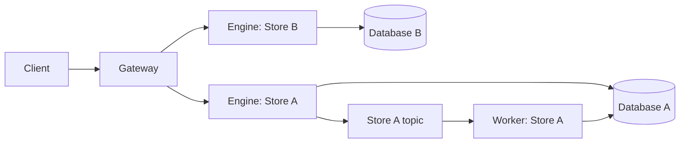

# Deploying Gateway, Engine and Worker

Use three independent process roles when Stores need independent capacity.
All roles use the same `sink` executable and strict YAML configuration. See the
[runnable Compose example](../examples/quickstart/README.md) and the
[design decisions](design/store-isolated-architecture.md).



Gateway exposes the existing seven public RPCs. Engine exposes the same RPCs for
its one Store, plus a private versioned forwarding RPC. Worker has no application
gRPC listener and calls the shared execution core directly. Asynchronous acceptance
still means that Engine's Kafka producer received durable acknowledgement; Gateway
never connects to Kafka or a database.

## Configuration

An Engine uses `mode: engine` and one `storage` mapping with `name`, `driver`,
and the existing driver/Kafka settings. Worker uses the same mapping with
`mode: worker`. The globally unique Store name is the only configured identity;
all Engine and Worker replicas of that Store use the same name.
A Store must have its own database target. Distinct URI aliases do not establish
that two targets are different. Deployment inventory must enforce this globally.
Engine checks the expected Store name on every forwarded call.
It rejects an entire mismatched batch before storage or publishing.

Gateway uses `mode: gateway`, `grpc`, `prometheus`, `service.request`, and `gateway`:

| Setting | Default | Meaning |
| --- | --- | --- |
| `gateway.routes_file` | required | Route YAML file; relative to the main config file |
| `gateway.reload_interval` | `5s` | Check for a complete new route snapshot |
| `gateway.dns_refresh_interval` | `30s` | Refresh DNS even while existing connections are healthy |
| `gateway.idle_timeout` | `5m` | Close channels that have no active calls and remain idle |
| `gateway.max_connections` | `256` | Maximum cached gRPC channels, created lazily; a channel can have multiple backend connections |
| `gateway.max_requests` | `128` | Maximum admitted public requests |
| `gateway.max_requests_per_store` | `min(32, max_requests)` | Maximum active forwarded calls to one Store |
| `gateway.max_bytes` | `256MiB` | Logical input/envelope/response reservations for admitted requests |
| `gateway.max_fanout` | `8` | Maximum parallel Store calls per public batch |

These are process limits, not RSS guarantees or recommended resource requests.
Gateway reserves known input/result overhead; reads, returned documents and native
replies additionally reserve their configured maximum response allowance. Plain
puts, deletes and async acceptance do not reserve a full document response quota.
Size limits do not include all Go, gRPC, TLS or OS allocation overhead.

The route file has this shape:

```yaml
routes:
  - store: primary
    target: dns:///primary-engine.example:443
    state: active
    tls:
      server_name: primary-engine.example
```

TLS with system trust roots and a minimum of TLS 1.2 is the default. An explicitly
trusted plaintext endpoint requires `tls.insecure: true`; it cannot also set
`server_name`. Sink's listener remains the existing plaintext gRPC listener;
terminate TLS in a trusted proxy when using TLS routes. Keep Engine endpoints
inside the trusted service network. Store name checking does not provide
client authentication or authorization.

Routes support `active`, `draining`, and `disabled`. Only `active` accepts new
Gateway requests. Already-started calls retain their original snapshot until they
finish or their deadline expires. Idle channels may be evicted sooner when the
cache is full; active channels are never evicted to make room. A full active cache
returns resource exhaustion without forwarding the request.

Replace the route file atomically. In containers, mount its containing directory
so an atomic file replacement is visible; a bind mount of a single file can pin
the old inode. Invalid reloads keep the previous snapshot;
an invalid initial file fails startup. Route files are limited to 4 MiB and 10,000
entries with unique Store names. Gateway retains no identity history for removed
routes; a Store can be re-added with a new Engine address. The name check cannot
detect a wrong database URI configured under the correct Store name. Database
migrations require coordinated deployment and data migration plans. Gateway
replicas converge independently: compare
`sink_gateway_config_info{sha256="..."}` before declaring a rollout complete.

Main configuration changes require a restart. `sink config check --config FILE`
also validates a Gateway's referenced route file offline.

## Request and failure behavior

Gateway groups complete Store subsets and maps every result back to the original
operation index. It carries Lua declarations into each subset and validates
request-wide declarations, operation counts and completion modes before dispatch.
Same-record operations remain together and retain their order. There is no
cross-Store transaction or global write ordering.

Reads and synchronous writes involving merge, conditional puts or returned
documents process Store groups in first-occurrence order. Snapshot, merge-input,
merge-output and returned-document budgets are independent. Each Engine receives
remaining grants and returns charges; coalesced requests retain separate grants.
CAS retries report their maximum charge per category. This conservative accounting
can reject a boundary-size cross-Store request that the old executor accepted.
Returned-document space is checked **before committing**, never truncated after
successful writes. Native requests apply the smaller of Gateway and Engine limits.

Unconditional puts without returned documents, deletes and async acceptance can
forward Store groups concurrently within `max_fanout`. The extra network hop and
serial budget-sensitive groups have a latency cost; benchmark your workload.

Gateway never automatically replays Write, Delete or Execute. Complete responses
from healthy Stores are retained when another Store fails. A lost mutation reply
is represented as a failed operation with `retryable=false`, since the effect may
already exist. A missing budget settlement consumes the entire grant; it cannot
be reused by another Store. A proven local rejection before dispatch consumes
nothing. The public unary RPC itself may be cancelled before any partial response
can reach the caller; completed writes are not rolled back.

Public gRPC status details survive forwarding, including the Scan admission retry
marker understood by existing SDKs. Client deadlines and cancellation propagate
to Engine. Neither SDK nor public protobuf changes are required.

## Readiness, metrics and scaling

HTTP metrics and health endpoints require `prometheus.enabled: true`; the listener
is disabled by default. Its address defaults to `:9090`. Gateway and Engine gRPC
health remain independent of this switch.

Gateway and Engine `/readyz` indicate that the process can serve its role. One
failed Engine does not make Gateway unready. Engine capability probes remain
`/readyz?service=sink.storage.STORE` and `...service=sink.kafka.STORE`. A database
failure does not disable Kafka acceptance, and Kafka failure does not disable
synchronous execution. Worker readiness checks its own dependencies. Gateway does
not proxy named dependency health services; its default gRPC health is process health.

Gateway exports bounded method/code labels with `sink_gateway_requests_total`,
`sink_gateway_request_duration_seconds`, `sink_gateway_engine_duration_seconds`,
`sink_gateway_in_flight_requests`, `sink_gateway_in_flight_bytes`,
`sink_gateway_rejected_total`, `sink_gateway_routes`,
`sink_gateway_route_reloads_total` and `sink_gateway_config_info`.
Engine retains the existing `sink_grpc_server_*`, admission, batching and Lua
metrics, labeled by the original public method even over private forwarding.
Worker retains the existing pending/oldest/last-poll/last-commit/retry/DLQ metrics.
Broker consumer lag comes from the external Kafka scaler or exporter.

KEDA or any other external scaler can query these signals. Gateway forwarding
capacity, Engine admission/latency, and Worker lag/age are separate scaling inputs.
CPU, resource requests, replica floors and scale-to-zero are deployment settings.
Engine and Worker replica maxima and pool sizes must jointly fit their Store's
backend capacity. Increasing Store A replicas creates no Store B database clients.
Gateway remains a shared ingress: exhausting its CPU, memory or global admission
capacity can affect multiple Stores. Per-Store forwarding limits contain individual
backend pressure; Gateway still needs its own capacity planning and scaling.

## New-cluster deployment

Deploy matching Gateway, Engine, Worker and SDK builds into a new cluster with
new Kafka topics and consumer groups. Validate URI routing and asynchronous
processing before the blue/green client cutover. See the [deployment guide](configuration-migration.md)
and [record address contract](record-addresses.md).
