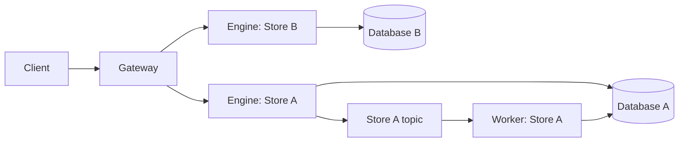

# Deploying Gateway, Engine and Worker

Use three independent process roles when Stores need independent capacity.
All roles use the same `sink` executable and strict YAML configuration. See the
[runnable Compose example](../examples/quickstart/README.md) and the
[design decisions](design/store-isolated-architecture.md).



Gateway exposes the existing seven public RPCs. Engine exposes private versioned forwarding and health RPCs for its one Store. Worker has no application
gRPC listener and calls the shared execution core directly. Asynchronous acceptance
still means that Engine's Kafka producer received durable acknowledgement; Gateway
never connects to Kafka or a database.

## Configuration

Engine uses `mode: engine`; Worker uses `mode: worker`. Both receive the same
Store file through `--store-config`, holding `name`, `storage` and shared `kafka`
policy. Component tuning remains in their own `--config` files.
A Store must have its own database target. Distinct URI aliases do not establish
that two targets are different. Deployment inventory must enforce this globally.
Engine checks the expected Store name on every forwarded call.
It rejects an entire mismatched batch before storage or publishing.

Gateway uses `mode: gateway`, `grpc`, `health`, `prometheus`, `request`, and `forwarding`:

| Setting | Default | Meaning |
| --- | --- | --- |
| `forwarding.routes` | required | Inline Store routes; every entry is active; restart after changes |
| `forwarding.dns_refresh_interval` | `30s` | Refresh DNS even while existing connections are healthy |
| `forwarding.idle_timeout` | `5m` | Close channels that have no active calls and remain idle |
| `forwarding.max_connections` | `256` | Maximum cached gRPC channels, created lazily; a channel can have multiple backend connections |
| `forwarding.max_fanout` | `8` | Maximum parallel Store calls per public batch |

These are process limits, not RSS guarantees or recommended resource requests.
Gateway checks process memory watermarks before forwarding new work. The gRPC send ceiling determines response
capacity. Clients control request deadlines; shutdown has its own bounded drain.

Routes belong to the same Gateway configuration:

```yaml
forwarding:
  routes:
    - store: primary
      target: dns:///primary-engine.example:443
      tls:
        server_name: primary-engine.example
```

TLS with system trust roots and a minimum of TLS 1.2 is the default. An explicitly
trusted plaintext endpoint requires `tls.insecure: true`; it cannot also set
`server_name`. Sink's listener remains the existing plaintext gRPC listener;
terminate TLS in a trusted proxy when using TLS routes. Keep Engine endpoints
inside the trusted service network. Store name checking does not provide
client authentication or authorization.

All configured routes are active. There is no route state flag or hot reload.
Add, remove, or update entries in `forwarding.routes`, then restart Gateway. During
a rolling restart, each instance uses the configuration loaded at its own startup.
Graceful shutdown drains accepted calls within the configured deadline; never
replay a write automatically just because its connection closes.

Idle channels may be evicted sooner when the cache is full; active channels are
protected. A full active cache returns resource exhaustion without forwarding.
DNS refresh still discovers Engine replica changes within a configured target.

An invalid configuration fails startup. Configuration files are limited to 4 MiB
and routes to 10,000 entries with unique Store names. Removing a route does not
delete its database or topics. Store name checks cannot detect a wrong database
URI under the correct name; database migration requires coordinated deployment.
Compare `sink_gateway_config_info{sha256="..."}` across Gateway replicas to
confirm their normalized startup routes match after a rolling restart.

`sink config check --config FILE` validates the configuration and inline routes
offline. All configuration changes require a restart.

## Request and failure behavior

Gateway groups complete Store subsets and maps every result back to the original
operation index. It carries Lua declarations into each subset and validates
request-wide declarations, operation counts and completion modes before dispatch.
Same-record operations remain together and retain their order. There is no
cross-Store transaction or global write ordering.

All Store groups use bounded concurrency within `max_fanout`. Read and Write
results are relayed as individual frames; Query and Scan stream documents followed
by their public page completion metadata. Forwarding carries no byte grants or
usage settlement. Each process applies its own message ceiling and existing
memory admission. Returned-write candidates must fit the Engine's local limit
before their own commit. Align Gateway and Engine message limits.

Gateway never automatically replays Write, Delete or Execute. Delivered results
remain known when an Engine stream fails. Missing mutation outcomes are reported
with `retryable=false` unless local non-dispatch or Engine's private rejection
trailer proves execution never started. An interrupted public stream cannot
roll back completed writes.

Errors and status details use standard gRPC trailers, including Scan's admission
retry marker. Successful EOF ends the private stream; there is no separate
settlement frame. Deadlines and cancellation propagate to Engine. The matching
streaming SDK and Server must be upgraded together.

## Readiness, metrics and scaling

See [rolling upgrades](rolling-upgrades.md) for the relationship between DNS
caching, refresh intervals, accepted request snapshots and termination grace.

HTTP health endpoints are always available at `health.address` (default `:8081`).
Prometheus uses its own `prometheus.address` (default `:9090`) and is disabled
unless `prometheus.enabled` is true. Gateway and Engine gRPC health remains
independent of Prometheus as well.

Gateway and Engine `/readyz` indicate that the process can serve its role. One
failed Engine does not make Gateway unready. Engine capability probes remain
`/readyz?service=sink.storage.STORE` and `...service=sink.kafka.STORE`. A database
failure does not disable Kafka acceptance, and Kafka failure does not disable
synchronous execution. Worker readiness checks its own dependencies. Gateway does
not proxy named dependency health services; its default gRPC health is process health.

Gateway exports bounded method/code labels with `sink_gateway_requests_total`,
`sink_gateway_request_duration_seconds`, `sink_gateway_engine_duration_seconds`,
`sink_gateway_in_flight_requests`, `sink_gateway_routes`,
and `sink_gateway_config_info`.
Engine retains the existing `sink_grpc_server_*`, in-flight request, batching and Lua
metrics, labeled by the original public method even over private forwarding.
Worker retains the existing pending/oldest/last-poll/last-commit/retry/DLQ metrics.
Broker consumer lag comes from the external Kafka scaler or exporter.

KEDA or any other external scaler can query these signals. Gateway forwarding
capacity, Engine admission/latency, and Worker lag/age are separate scaling inputs.
CPU, resource requests, replica floors and scale-to-zero are deployment settings.
Engine and Worker replica maxima and pool sizes must jointly fit their Store's
backend capacity. Increasing Store A replicas creates no Store B database clients.
Gateway remains a shared ingress: exhausting its CPU, memory or global admission
pressure can affect multiple Stores. Gateway needs its own capacity planning and scaling.
All roles expose process [memory watermark metrics](observability.md#memory-capacity-and-keda).

## New-cluster deployment

Deploy matching Gateway, Engine, Worker and SDK builds into a new cluster with
new Kafka topics and consumer groups. Validate URI routing and asynchronous
processing before the blue/green client cutover. See the [deployment guide](configuration-migration.md)
and [record address contract](record-addresses.md).
